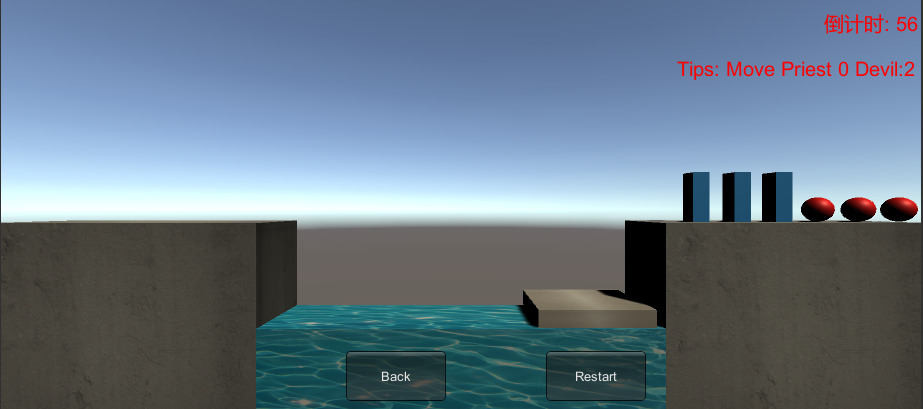
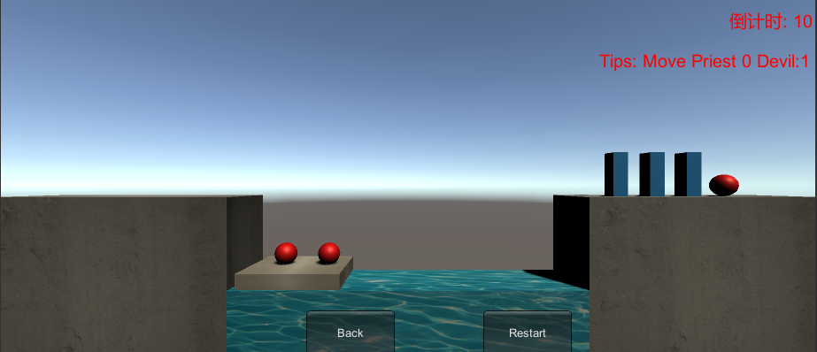

# 游戏智能

[toc]

[Github地址]( https://github.com/wywwwwei/3DGameProgramming/tree/master/HW10)

[视频演示]( https://www.bilibili.com/video/av78534015 )

## 实现状态图的自动生成

- 这里我通过深度搜索来实现找到最终结果的方案

## 数据在程序中的表示方法

- 通过二进制来表示当前的游戏状态

  0 表示人物/船 在左边，1则表示在右边

  低三位表示Devil，低四到六位表示Priest，第七位表示船

  > 其实一开始是想表示具体哪一位需要被移动，但是好像都是一样的，并不需要说明具体，但是代码已经开始了，就不修改了，通过maps数组实现转换
  >
  > ```c#
  > //对应二进制数中1的个数
  > public int[] maps = new int[]{0,1,1,2,1,2,2,3};
  > ```

- 所以游戏的实现就是寻找状态从 0b1111111 -> 0b0000000 的转换

##  算法实现 

### 从状态中获取人物数量

```c#
public bool getBoatState(int curState){
    return Convert.ToBoolean(curState & 0x40);
}

public int getPriestRight(int curState){
    return maps[((curState & 0x38) >> 3)];
}

public int getPriestLeft(int curState){
    return maps[((curState & 0x38)>>3)^0x07];
}

public int getDevelRight(int curState){
    return maps[(curState & 0x07)];
}

public int getDevilLeft(int curState){
        return maps[(curState & 0x07) ^ 0x07];
}
```

### 如何发生状态转换

表示将Priest/Devil从左移动到右/从右移动到左

寻找Priest/Devil对应位，将前num个 1/0 转为 0/1，若没有num个，则返回b1000000表示异常

```c#
public int movePriestOrDevil(int curState,int num,bool Priest){
        int newState = curState;
        int count = 0;
        int mask = Priest ? 0x20 : 0x04;
        if(Convert.ToBoolean(curState & 0x40)){
            newState &= ~(0x40);
            for(int i = 0;i<3;i++){
                if(Convert.ToBoolean(curState&mask)){
                    newState &= ~(mask);
                    count++;
                }
                if(count == num){
                    return newState;
                }
                mask = mask >> 1;
            }
            
        }else{
            newState |= 0x40;
            for(int i = 0;i<3;i++){
                if(Convert.ToBoolean((~curState) & mask)){
                    newState |= mask;
                    count++;
                }
                if(count == num){
                    return newState;
                }
                mask = mask >> 1;
            }
        }
        return 0b10000000;
    }
```

### 深搜的实现

> 当找到第一个解，就返回，并且不继续查找

```c#
public void dfs(int curState){
        if(curState == 0b00000000){
            result.Add(curState);
            findAnswer = true;
            return;
        }
        visited[curState] = true;
        int newState1 = movePriestOrDevil(curState,1,true);//移动一位Priest
        int newState2 = movePriestOrDevil(curState,2,true);//移动两位Priests
        int newState3 = movePriestOrDevil(curState,1,false);//移动一位Devil
        int newState4 = movePriestOrDevil(curState,2,false);//移动两位Devil
        int newState5 = movePriestAndDevil(curState);//同时移动
        //Debug.Log("NewState:"+newState1+":"+newState2+":"+newState3+":"+newState4+":"+newState5);
        if(newState1 != 0b10000000 && !visited[newState1]){
            visited[newState1] = true;
            if(checkState(newState1))
                dfs(newState1);
            if(findAnswer){
                result.Add(newState1);
                return;
            }
        }
        if(newState2 != 0b10000000 && !visited[newState2]){
            visited[newState2] = true;
            if(checkState(newState2))
                dfs(newState2);
            if(findAnswer){
                result.Add(newState2);
                return;
            }
        }
        if(newState3 != 0b10000000 && !visited[newState3]){
            visited[newState3] = true;
            if(checkState(newState3))
                dfs(newState3);
            if(findAnswer){
                result.Add(newState3);
                return;
            }
        }
        if(newState4 != 0b10000000 && !visited[newState4]){
            visited[newState4] = true;
            if(checkState(newState4))
                dfs(newState4);
            if(findAnswer){
                result.Add(newState4);
                return;
            }
        }
        if(newState5 != 0b10000000 && !visited[newState5]){
            visited[newState5] = true;
            if(checkState(newState5)){
                dfs(newState5);
                return;
            }
            if(findAnswer){
                result.Add(newState5);
                return;
            }
        }
        return;      
    }
```

### 对于是否重新寻找路径

> 如果我们是按照提示来的，那么我们不必重新计算

```c#
public int AIMove(){
        updateState();
        if(state == 0){
            return 0;
        }
        if(result.Count > 0){		//如果之前已经找到过结果
            int cmp = result[result.Count-1];
            int statePriest = maps[((state & 0x38)>>3)];
            int stateDevil = maps[state&0x07];
            int nextPriest = maps[((cmp & 0x38)>>3)];
            int nextDevil = maps[cmp&0x07];
            if(statePriest == nextPriest && stateDevil == nextDevil){//判断是否按tips走
                result.RemoveAt(result.Count-1);
                Debug.Log("current Reuslt:"+result[result.Count-1]);
                int res = result[result.Count-1] ;
                nextPriest = maps[(res&0x38)>>3];
                nextDevil = maps[res & 0x07];
                return (nextPriest - statePriest > 0?nextPriest - statePriest:-(nextPriest - statePriest))*10+(nextDevil-stateDevil>0?nextDevil-stateDevil:-(nextDevil-stateDevil));
            }
        }
        for(int i = 0;i<0x80;i++){
            visited[i] = false;
        }
        result.Clear();
        findAnswer = false;
        dfs(state);				//重新寻找路径
        Debug.Log("Over");
        if(findAnswer == false){
            return 0b100000000;
        }
        Debug.Log("result:"+result[result.Count-1]);
        int change = (result[result.Count-1] & 0x3F)^(state & 0x3F);
        return maps[change>>3]*10+maps[change & 0x07];
    }
```

## 结果截图



