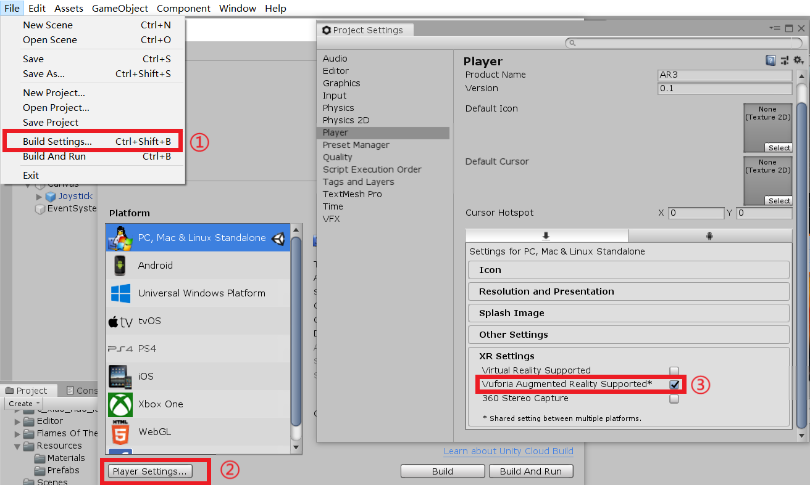
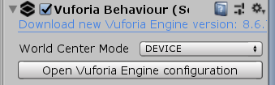
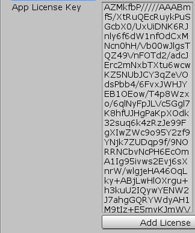
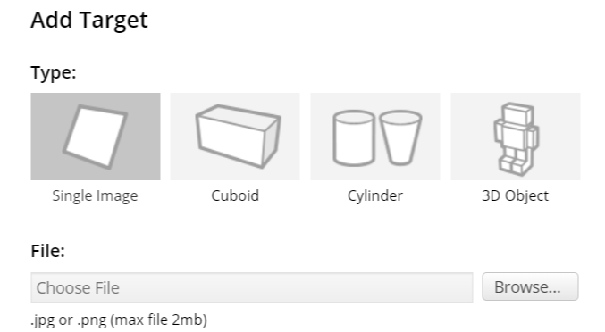
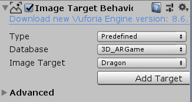
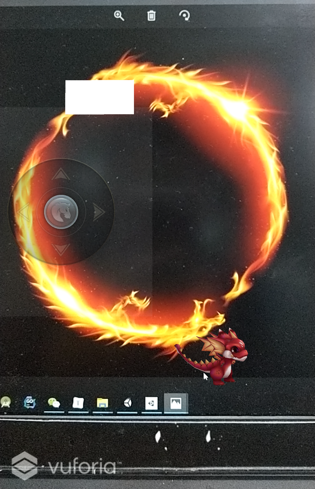
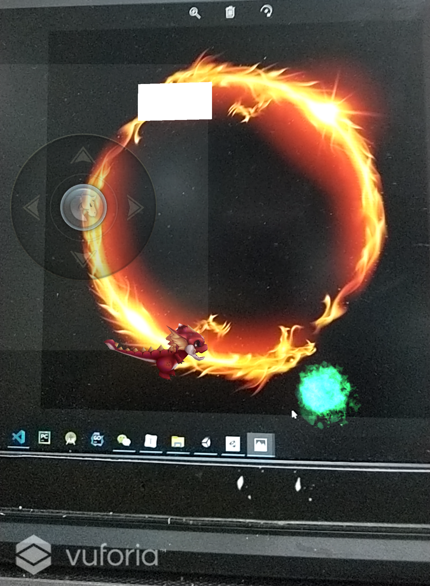

# AR简单应用

[toc]

[Github项目地址](https://github.com/wywwwwei/3DGameProgramming/tree/master/HW10)

[视频演示地址](https://www.bilibili.com/video/av80390262/)

AR把虚拟世界的物体叠加在现实世界的影像或视频中的物体上，玩家在现实的背景上与虚拟世界物体互动。

**[增强现实](https://en.wikipedia.org/wiki/Augmented_reality)**（Argumented Reality (AR)）是一种将真实世界信息和虚拟世界信息“无缝”集成的新技术，是把原本在现实世界的一定时间空间范围内很难体验到的实体信息(视觉信息,声音,味道,触觉等),通过电脑等科学技术，模拟仿真后再叠加，将虚拟的信息应用到真实世界，被人类感官所感知，从而达到超越现实的感官体验。

## 添加Vuforia和初始设置

1. 添加Vuforia包

   

2. 创建证书

   > 用于获取License Key。Vuforia在Unity中需要相应的Key对SDK进行配置

   [获取证书](https://developer.vuforia.com/vui/develop/licenses)

   然后将App License Key添加到AR Camera中

   选中AR Camera，然后在Inspector中选中 Open Vuforia Engine configuration

   

   填入App License Key

   

3. 创建目标数据库

   [创建数据库](https://developer.vuforia.com/vui/develop/databases)

   将特定识别的目标提前上传至数据库进行特征提取。目标有多种类型，此处选择image，以对单幅图像进行识别。

   

   添加完之后，选择Download Database(All)，下载数据库打包好的UnityPackage包

   然后在Unity中导入

4. 挂载模型

   添加Image Target，然后将准备好的模型挂载到上面作为子对象

   并对Image Target的Image Target Behaviour 进行配置

   

## 简单小模型——小火龙

简单介绍：

该APP可实现AR小火龙模型，可通过**UGUI实现的摇杆**控制移动，通过**虚拟按键**实现攻击特效

### 截图

| Test                     | Test                     |
| ------------------------ | ------------------------ |
|  |  |

### 代码实现

- UGUI实现的摇杆

  > 参考Github项目：[Bian-Sh/UniJoystick](https://github.com/Bian-Sh/UniJoystick)

  通过EventListener和Character Controller组件实现

  ```c#
  public class ThirdPersonSolution : MonoBehaviour
      {
          [SerializeField] Joystick joystick;
          public float speed = 3;
          private Animation _animation;
          CharacterController controller;
          void Start()
          {
              controller = GetComponent<CharacterController>();
              _animation = GetComponent<Animation>();
              joystick.OnValueChanged.AddListener(v =>
              {
                  if (v.magnitude != 0)
                  {
                      //当移动时，添加移动动画到队列中
                      _animation.PlayQueued("sj001_run", QueueMode.CompleteOthers, PlayMode.StopSameLayer);
                      Vector3 direction = new Vector3(v.x, v.y, 0);
                      controller.Move(direction * speed * Time.deltaTime);
                      transform.rotation = Quaternion.LookRotation(new Vector3(v.x, 0, v.y));
                  }
              });
          }
      }
  ```

  ```c#
  public JoystickEvent OnValueChanged = new JoystickEvent(); //事件 ： 摇杆被 拖拽时
  public JoystickEvent OnPointerDown = new JoystickEvent(); // 事件： 摇杆被按下时
  public JoystickEvent OnPointerUp = new JoystickEvent(); //事件 ： 摇杆上抬起时
  
  void IPointerDownHandler.OnPointerDown(PointerEventData eventData)
  {
      if (eventData.pointerId < -1 || IsDraging) return; //适配 Touch：只响应一个Touch；适配鼠标：只响应左键
      fingerId = eventData.pointerId;
      pointerDownPosition = eventData.position;
      OnPointerDown.Invoke(eventData.position);
  }
  
  void IDragHandler.OnDrag(PointerEventData eventData)
  {
      if (fingerId != eventData.pointerId) return;
      Vector2 direction = eventData.position - (Vector2)pointerDownPosition; //得到BackGround 指向 Handle 的向量
      float radius = Mathf.Clamp(Vector3.Magnitude(direction), 0, maxRadius); //获取并锁定向量的长度 以控制 Handle 半径
      Vector2 localPosition = new Vector2()
      {
          x = (0 != (activatedAxis & Direction.Horizontal)) ? (direction.normalized * radius).x : 0, //确认是否激活水平轴向
          y = (0 != (activatedAxis & Direction.Vertical)) ? (direction.normalized * radius).y : 0       //确认是否激活垂直轴向，激活就搞事情
      };
      handle.localPosition = localPosition;      //更新 Handle 位置
  }
  
  void IPointerUpHandler.OnPointerUp(PointerEventData eventData)
  {
      if (fingerId != eventData.pointerId) return;//正确的手指抬起时才会重置摇杆；
      RestJoystick();
      OnPointerUp.Invoke(eventData.position);
  }
  //重置摇杆
  void RestJoystick()
  {
      backGround.localPosition = backGroundOriginLocalPostion;
      handle.localPosition = Vector3.zero;
      fingerId = int.MinValue; 
  }
  ```

- 攻击特效是通过粒子系统实现的（所用粒子系统从Asset Store获取）

  这里我们运用工厂模式来实现攻击特效的重新利用

  ```c#
  public class AttackFactory
  {
      protected static AttackFactory attackFactory;
      private List<GameObject> isFree = new List<GameObject>();       //空闲粒子系统
      private List<GameObject> isInuse = new List<GameObject>();      //正在使用的粒子系统
      public static AttackFactory getInstance(){
          if(attackFactory == null ){
              attackFactory = new AttackFactory();
          }
          return attackFactory;
      }
  	
      //传入的参数为人物当前位置和人物正前方方向
      public GameObject getAttack(Vector3 begin,Vector3 direction){
          GameObject need;
          if(isFree.Count<=0){
              need = UnityEngine.Object.Instantiate(Resources.Load<GameObject>("Prefabs/Fire_Ghost_CampFire Variant"),begin, Quaternion.Euler(direction))as GameObject;
              need.AddComponent<Attacks>();
          }else{
              need = isFree[0];
              isFree.Remove(need);
              need.SetActive(true);
              need.transform.position = begin;
              need.transform.rotation = Quaternion.Euler(direction);
          }
          isInuse.Add(need);
          return need;
      }
  
      public void free(GameObject toFree){
          toFree.SetActive(false);
          isInuse.Remove(toFree);
          isFree.Add(toFree);
      }
  }
  ```

  为每一个粒子系统，我们添加一个移动和判断是否进行回收的组件

  - 当粒子系统出超出攻击范围，则调用工厂类回收自身对象

  ```c#
  //挂载在发射物上
  public class Attacks : MonoBehaviour {
      public Vector3 destination;             //人物位置 + 人物正前方向*攻击范围
      public bool ifMove = false;             //是否发射
      public float attackSpeed = 2f;          //移动速度
      private AttackFactory attackFactory;   
      private void Start() {
          attackFactory = AttackFactory.getInstance();     
      }
      private void Update() {
          if(ifMove){
              this.gameObject.transform.position = Vector3.MoveTowards(this.gameObject.transform.position,destination,attackSpeed*Time.deltaTime);
              if (Vector3.Distance(transform.position, destination) < 1f)
              {
                  Debug.Log("arrive");
                  ifMove = false;
                  attackFactory.free(this.gameObject);
              }
          }
      }
  }
  ```

- 最后就是小火龙实现攻击的函数，这里我们定义一个IUserAction的接口，方便后面虚拟按键的调用

  ```c#
  public interface IUserAction
  {
      void attack();
  }
  ```

  ```c#
  public class Attack : MonoBehaviour,IUserAction
  {
      private Animation _animation;
      private Transform pos;
      private AttackFactory attackFactory;
      public float attackRange = 30f;     //攻击范围，超出就回收
      private Vector3 attackPosOffset = new Vector3(0f,0.3f,0f); //发射位置相较于人物位置的偏移
      private void Start() {
          pos = this.gameObject.transform; 
          attackFactory = AttackFactory.getInstance();   
          _animation = this.gameObject.GetComponent<Animation>();
      }
      public void attack(){
          _animation.Play("sj001_skill2");
          Vector3 position = pos.position + attackPosOffset;
          Vector3 direction = pos.rotation.eulerAngles;
          Vector3 destination = position + pos.forward * attackRange;
          GameObject attack = attackFactory.getAttack(position,direction);
          attack.GetComponent<Attacks>().destination = destination;
          attack.GetComponent<Attacks>().ifMove = true;
      }
  }
  ```

- 虚拟按键的创建

  在 Image Target -> Inspector -> Advanced ->Add Virtual Button

  然后挂载脚本，实现IVirtualButtonEventHandler接口

  ```c#
  //挂载在人物上
  public class VirtualButtonEventHandler : MonoBehaviour,IVirtualButtonEventHandler {
      //virtual button
      public GameObject btn;
      public IUserAction action;
      private void Start() {
          action = this.gameObject.GetComponent<Attack>();
          VirtualButtonBehaviour vbb = btn.GetComponent<VirtualButtonBehaviour>();
          if (vbb){
              vbb.RegisterEventHandler(this);
          }
      }
  
      public void OnButtonPressed(VirtualButtonBehaviour vb){
          Debug.Log("attack");
          action.attack();
      }
  
      public void OnButtonReleased(VirtualButtonBehaviour vb){
          Debug.Log("end");
      }
  }
  ```

### 打包成apk

我们需要修改unity的gradle template（如果使用Unity的gradle的化）

这里我的目录是E:\program files\UnityEditor\2019.2.4f1\Editor\Data\PlaybackEngines\AndroidPlayer\Tools\GradleTemplates

将所有的*.gradle其中的repositories添加

```
maven { url 'http://maven.aliyun.com/nexus/content/repositories/google' }
maven { url 'http://maven.aliyun.com/nexus/content/repositories/jcenter'}
```

然后修改包名之类的，就可以连接手机 Build And Run / 直接 Build