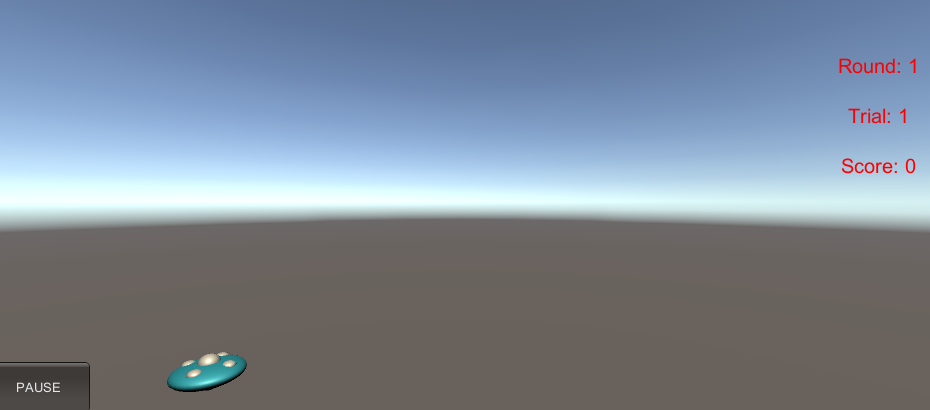

# 简单的鼠标打飞碟（Hit UFO）游戏

[博客地址](https://blog.csdn.net/WeiXiaoAssassin/article/details/102487093)
[视频演示](https://www.bilibili.com/video/av70766609/)

[TOC]

## 作业要求

- 游戏内容要求：
  1. 游戏有 n 个 round，每个 round 都包括10 次 trial；
  2. 每个 trial 的飞碟的色彩、大小、发射位置、速度、角度、同时出现的个数都可能不同。它们由该 round 的 ruler 控制；
  3. 每个 trial 的飞碟有随机性，总体难度随 round 上升；
  4. 鼠标点中得分，得分规则按色彩、大小、速度不同计算，规则可自由设定。
- 游戏的要求：
  - 使用带缓存的工厂模式管理不同飞碟的生产与回收，该工厂必须是场景单实例的！具体实现见参考资源 Singleton 模板类
  - 近可能使用前面 MVC 结构实现人机交互与游戏模型分离

## 游戏规则

> 一共有3 Rounds，每一 Round 有 10 次 Trial ， 游戏难度随Round增加
>
> 可通过 菜单 实现跳过当前 Round/ Trial ，但是会减掉当前Trial的分数
>
> 点击飞碟加分，飞碟飞出屏幕即扣分，最后总分如果小于30则为输

## 游戏界面





## 游戏设计

### Model

1. Interface 是游戏过程中需要使用的接口文件

   - ISceneController 场景控制器（场记）
   - IUserAction 用户动作管理器（负责游戏界面按钮动作）
   - IHomeAction 用户动作管理器（负责主页面按钮动作）
   - ISSActionCallback 游戏动作管理器的回调（callback）类

2. 其次就是游戏中生产 UFO 的 相关类

   - UFOFactory —— 生产，缓存，重用UFO，根据 Ruler 返回不同的 UFO 供控制器使用

     ```c#
     public class UFOFactory{
         protected static UFOFactory ufofactory;
         protected Ruler ruler = new Ruler();
         private List<GameObject> isFree = new List<GameObject>();
         private List<GameObject> isInuse = new List<GameObject>();
         //单例模式
         public static UFOFactory getInstance(){
             if(ufofactory == null ){
                 ufofactory = new UFOFactory();
             }
             return ufofactory;
         }
         //根据Ruler返回UFO
         public GameObject getUFO(int round){
             GameObject need;
             if(isFree.Count <= 0){
                 need = UnityEngine.Object.Instantiate(Resources.Load<GameObject>("Prefabs/UFO"),ruler.getStart(), Quaternion.identity)as GameObject;
                 need.AddComponent<UFO>();
                 Rigidbody rigidbody = need.AddComponent<Rigidbody>();
                 rigidbody.useGravity = false;
             }
             else{
                 need = isFree[0];
                 isFree.Remove(need);
             }
             isInuse.Add(need);
             //根据Ruler设置UFO
             int index = ruler.getColor();
             Material material = UnityEngine.Object.Instantiate(Resources.Load<Material>("Materials/" + Enum.GetName(typeof(Ruler.Color),index)));
             need.GetComponent<MeshRenderer>().material = material;
     
             UFO ufo = need.GetComponent<UFO>();
             ufo.setScale(ruler.getScale(Judge.getInstance().getRound()));
             need.transform.position = ruler.getStart();
             ufo.setDespos(ruler.getDes(need.transform.position));
             ufo.setScore(index+1);
     
             return need;
         }
         //完成被点击用户的动作
         public void recycle(GameObject toRecycle){
             if(isInuse.Contains(toRecycle)){
                 toRecycle.transform.position = toRecycle.GetComponent<UFO>().desPosition;
             }
         }
         //回收UFO
         public void free(GameObject toFree){
             isFree.Add(toFree);
             isInuse.Remove(toFree);
         }
     }
     ```

   - UFO —— 记录每一个被使用的UFO的信息（发射位置，是否被点击）

     ```c#
     public class UFO : MonoBehaviour {
         public int score = 1;
         public Vector3 desPosition;
         public Vector3 baseScale = new Vector3(1.5f,0.5f,1.5f);
         public bool isClicked;
         public void setScale(float multi){
             this.gameObject.transform.localScale = new Vector3(baseScale.x * multi,baseScale.y*multi,baseScale.z*multi);
         }
         public void setScore(int _score){
             score = _score;
         }
         public void setDespos(Vector3 desPos){
             desPosition = desPos;
         }
     }
     ```

   - Ruler —— 通过控制UFO的属性来控制每一Round的难度

     ```c#
     public class Ruler{
         public enum Color{ White, Red , Green , Blue };
         private System.Random random = new System.Random();
         //设置UFO数量
         public int getUFOCount(int round){
             return round * 3;
         }
         //设置颜色
         public int getColor(){
             var index = random.Next(Enum.GetValues(typeof(Color)).Length);
             return index;
         }
         //设置大小
         public float getScale(int round){
             return 1.3f - 0.1f * (random.Next(1) + 1)* round;
         }
         //设置速度
         public float getSpeed(int round){
             return 1.0f + 0.1f * round;
         }
         //设置发射点
         public Vector3 getStart(){
             Vector3 newValue = new Vector3();
             newValue.x = ((random.Next() & 2) - 1)*(random.Next(10) + 14);
             newValue.y = ((random.Next() & 2) - 1)*(random.Next(10) + 8);
             newValue.z = 0;
             return newValue;
         }
         //设置终点
         public Vector3 getDes(Vector3 temp){
             temp.x = -temp.x;
             temp.y = -temp.y;
             return temp;
         }
         //设置发射间隔
         public float getIntervals(int round){
             return 1.0f - 0.1f * round * (random.Next(3)+1);
         }
     }
     ```

### View

1. 主页界面

   元素：

   Label —— 游戏名

   Button "Start" —— 开始游戏

   Button “Quit" —— 退出游戏

2. 游戏界面

   元素：

   状态：GameStatus.Gaming

   ​	Button "Pause" —— 暂停游戏，调出菜单

   状态：！GameStatus.Gaming

   ​	Button "Continue" —— 继续游戏

   ​	Button "Back" —— 返回主界面

   ​	Button "Restart" —— 重新游戏

   ​	Button "Next Round" —— 下一Round

   ​	Button "Next Trial" —— 下一Trial

   ​	Label —— 记录Round / Trial / Score

   ```c#
   private void OnGUI() {
       //In order to facilitate positioning control
       float screenWidth = UnityEngine.Screen.width;
       float screenHeight = UnityEngine.Screen.height;
       if(judgement.getCurStatus() == GameStatus.Gaming)
       {
           float buttonWidth = 100;
           float buttonHeight = 50;
           if(GUI.Button(new Rect(0, (screenHeight-buttonHeight), buttonWidth, buttonHeight), "PAUSE"))
           {
               action.menu();
           }
       }
       else
       {
           //Add Button
           float buttonWidth = 100;
           float buttonHeight = 50;
           float spaceBetweenButton = 30;
           if(GUI.Button(new Rect(0, (screenHeight-buttonHeight), buttonWidth, buttonHeight), "CONTINUE"))
           {
               action.recover();
           }
           if(GUI.Button(new Rect((screenWidth-spaceBetweenButton)/2-buttonWidth, (screenHeight-buttonHeight)*19/20, buttonWidth, buttonHeight), "Back"))
           {
               action.back();
           }
           if(GUI.Button(new Rect((screenWidth-spaceBetweenButton)/2+buttonWidth, (screenHeight-buttonHeight)*19/20, buttonWidth, buttonHeight), "Restart"))
           {
               action.restart();
           }
           if(GUI.Button(new Rect((screenWidth-spaceBetweenButton)/2-buttonWidth, (screenHeight-buttonHeight)*3/4, buttonWidth, buttonHeight), "Next Round"))
           {
               action.nextRound();
           }
           if(GUI.Button(new Rect((screenWidth-spaceBetweenButton)/2+buttonWidth, (screenHeight-buttonHeight)*3/4, buttonWidth, buttonHeight), "Next Trial"))
           {
               action.nextTrial();
           }
   
           //Add Lable
           float resultWidth = 500;
           float resultHeight = 50;
           string cur_text=" ";
           GUIStyle fontStyle= new GUIStyle();
           fontStyle.alignment = TextAnchor.MiddleCenter;
           fontStyle.fontSize = 40;
           fontStyle.normal.textColor = Color.red;
           switch(judgement.getCurStatus()){
                   case GameStatus.Win:
                       cur_text="You Win!!!";
                       break;
                   case GameStatus.Lose:
                       cur_text="You Lose!!!";
                       break;
               }
           GUI.Label(new Rect((screenWidth-resultWidth)/2, (screenHeight-resultHeight)*2/7, resultWidth, resultHeight), cur_text,fontStyle);
       }
       //Add Score Lable
       float scoreWidth = 100;
       float scoreHeight = 50;
       GUIStyle scoreFontStyle= new GUIStyle();
       scoreFontStyle.alignment = TextAnchor.MiddleCenter;
       scoreFontStyle.fontSize = 20;
       scoreFontStyle.normal.textColor = Color.red;
       GUI.Label(new Rect((screenWidth-scoreWidth), scoreHeight,scoreWidth,scoreHeight), "Round: " + judgement.getRound(), scoreFontStyle);
       GUI.Label(new Rect((screenWidth-scoreWidth), scoreHeight*2,scoreWidth,scoreHeight), "Trial: " + judgement.getTrial(), scoreFontStyle);
       GUI.Label(new Rect((screenWidth-scoreWidth), scoreHeight*3,scoreWidth,scoreHeight), "Score: " + judgement.getScore(), scoreFontStyle);
   }
   ```

### Controller

1. Director —— 导演类

   - 获取当前游戏的场景
   - 控制场景运行、切换、入栈与出栈
   - 暂停、恢复、退出
   - 管理游戏全局状态
   - 设定游戏的配置
   - 设定游戏全局视图

   ```c#
   public class Director : System.Object
   {
       private static Director _instance;
   
       public ISceneController currentSceneController { get;set;}
   
       public bool running{ get; set;}
   
       public static Director getInstance(){
           if(_instance == null ){
               _instance = new Director();
           }
           return _instance;
       }
   
       public void LoadScene(int num){
           SceneManager.LoadScene(num);
       }
       public int getFPS(){
           return Application.targetFrameRate;
       }
   
       public void setFPS(int fps){
           Application.targetFrameRate = fps;
       }
   }
   ```

2. HomeSceneController —— 主页场景控制器（场记）

   - 管理本次场景所有的游戏对象
   - 协调游戏对象（预制件级别）之间的通讯
   - 响应外部输入事件
   - 管理本场次的规则（裁判）
   - 各种杂务

   ```c#
   void Awake() {
       Director director = Director.getInstance();
       director.setFPS(60);
       director.currentSceneController = this;
       director.currentSceneController.LoadResources();
       this.gameObject.AddComponent<HomeGUI>();
   }
   
   public void startGame(){
       Director.getInstance().LoadScene(1);
   }
   public void finish(){
       Application.Quit();
   }
   ```

3. GameSceneController —— 游戏场景控制器（场记）

   **这里我想错了，我应该使用后面的动作类（SSActionSequence）来管理发送次序，等到某个UFO到达目的地之后再启用下一个发送，不然可能会造成 rigidbody 碰撞导致位置动作错乱的问题，有时间我会重新Update**

   从工厂获取由 Ruler 规定数量 的 UFO，通过 协程 设置UFO出现的时间

   ```c#
   public void LoadResources(){
       curTrialUFO = ruler.getUFOCount(judgement.getRound());
       getUFO();
   }
   //获取UFO
   void getUFO(){
       for(int i = 0;i < curTrialUFO;i++){
           Debug.Log("fly");
           waitToFly.Add(UFOFactory.getInstance().getUFO(judgement.getRound()));
       }
       setFly();
   }
   //设置发送
   void setFly(){
       float waitTime = 0;
       for(int i = 0;i < waitToFly.Count;i++){
           if( i == 0 ){
               actionManager.FlyUFO(waitToFly[i],ruler,judgement.getRound());
               haveFly.Add(waitToFly[i]);
           }else{
               StartCoroutine(Fly(waitTime,waitToFly[i]));
           }
           waitTime += ruler.getIntervals(judgement.getRound());
       }
       StartCoroutine(Next(waitTime));
       waitToFly.Remove(waitToFly[0]);
   }
   //设置协程，按次序发出
   IEnumerator Fly(float time,GameObject gameobj){
       yield return new WaitForSeconds(time);
       actionManager.FlyUFO(gameobj,ruler,judgement.getRound());
       haveFly.Add(gameobj);
       waitToFly.Remove(gameobj);
   }
   ```

   实现IUserAction接口的按钮动作

   ```c#
   //结束游戏
   //关闭所有协程，回收所有gameobject
   public void endGame(){
       StopAllCoroutines();
       recycle();
   }
   //回收所有gameobject
   public void recycle(){
       for(int i = 0;i < waitToFly.Count;i++){
           UFOFactory.getInstance().free(waitToFly[i]);
       }
       for(int i = 0;i < haveFly.Count;i++){
           UFOFactory.getInstance().recycle(haveFly[i]);
       }
       waitToFly.Clear();
       haveFly.Clear();
   }
   //重新开始
   public void restart(){
       endGame();
       loadInitSetting();
       recover();
       LoadResources();
   }
   //返回主界面
   public void back(){
       Director.getInstance().LoadScene(0);
   }
   //下一Trial
   public void nextTrial(){
       endGame();
       judgement.setTrial(judgement.getTrial()+1);
       recover();
       LoadResources();
   }
   //下一Round
   public void nextRound(){
       endGame();
       judgement.setRound(judgement.getRound()+1);
       recover();
       LoadResources();
   }
   //调出菜单
   public void menu(){
       Time.timeScale = 0;
       judgement.stop();
   }  
   //继续
   public void recover(){
       Time.timeScale = 1;
       judgement.recover();
   }
   ```

### Action

1. checkClick —— 用于光标点击对象的类

   通过在主摄像机设置ray，在再设置物体为rigidbody，即可实现游戏对象点击事件，当点击之后，就让运动事件结束 / 回收对象。

   ```c#
   void Update () {
       if (Input.GetButtonDown("Fire1")) 
       {
           Debug.Log ("Fired Pressed");
           Debug.Log (Input.mousePosition);
   
           Vector3 mp = Input.mousePosition; //get Screen Position
   
           Ray ray = Camera.main.ScreenPointToRay(Input.mousePosition);
   
           RaycastHit hit;
           if (Physics.Raycast(ray, out hit)) {
               if (hit.collider.gameObject.tag.Contains("UFO")) { //plane tag
                   Debug.Log ("hit " + hit.collider.gameObject.name +"!" ); 
               }
               UFO ufo = hit.transform.gameObject.GetComponent<UFO>();
               ufo.isClicked = true;
               judgement.addScore(ufo.score);
               UFOFactory.getInstance().recycle(hit.transform.gameObject);
           }
       }		
   }
   ```

2. CCMoveToAction —— UFO通过MoveTowards移动到目的地

   ```c#
   public static CCMoveToAction GetSSAction(GameObject gameObject,Vector3 _target,float speed,ISSActionCallback _callback){
       CCMoveToAction action = ScriptableObject.CreateInstance<CCMoveToAction>();
   
       action.target = _target;
       action.speed = speed;
       action.gameobject = gameObject;
       action.transform = gameObject.transform;
       action.callback = _callback;
   
       return action;
   }
   
   public override void Update(){
       this.transform.position = Vector3.MoveTowards(this.transform.position,target,speed* Time.deltaTime);
       if(this.transform.position == target){
           this.destroy = true;
           this.callback.SSActionEvent(this);
       }
   
   }
   ```

3. ActionManager —— 动作管理

   负责给controller调用的接口

   ```c#
   public void FlyUFO(GameObject gameObject,Ruler ruler,int round){
       
       CCMoveToAction action = CCMoveToAction.GetSSAction(gameObject,ruler.getDes(gameObject.transform.position),ruler.getSpeed(round)*AnimateSpeed,this);
               
       addAction(action);
       
      }
   ```

   回调函数 （当动作执行完毕后回收对象）

   ```c#
   public void SSActionEvent(SSAction source,
       SSActionEventType events = SSActionEventType.Competeted,
       int intParam = 0,
       string strParam = null){
           UFO ufo = source.gameobject.GetComponent<UFO>();
           if(!ufo.isClicked){
               Judge.getInstance().subScore(ufo.score);
           }
           UFOFactory.getInstance().free(source.gameobject);
   }
   ```

   
