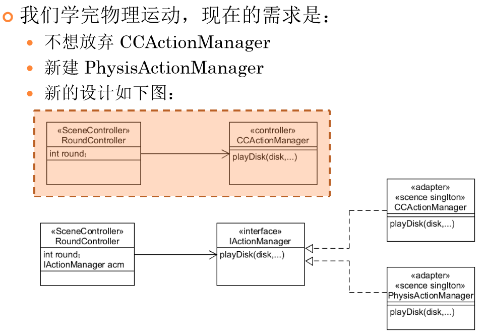

#  改进飞碟（Hit UFO）游戏 

[toc]

[Hit UFO v1]( https://github.com/wywwwwei/3DGameProgramming/tree/master/HW5 )

[视频演示地址]( https://www.bilibili.com/video/av71665394/ )

> 游戏内容要求：
>
> 1. 按 *adapter模式* 设计图修改飞碟游戏
> 2. 使它同时支持物理运动与运动学（变换）运动



在这里，我所实现的物理运动是Rigidbody的碰撞功能，我们做的第一个版本是没有考虑这个问题（虽然实现了，但是存在一些问题）的，这里我们采用adapter模式来增加新的（物理）动作管理者


## Adapter模式

Adapter模式使用场景

- 假设你设计了电商网站，它有一个实用简单同一的支付接口 ，现在这个接口要对接工行、农行、… 、微信、支付宝 、财付通、… 的接口。我们就可以通过该模式应对业务变化。

介绍

- **意图：**将一个类的接口转换成客户希望的另外一个接口。适配器模式使得原本由于接口不兼容而不能一起工作的那些类可以一起工作。

- **主要解决：**主要解决在软件系统中，常常要将一些"现存的对象"放到新的环境中，而新环境要求的接口是现对象不能满足的。

- **何时使用：** 1、系统需要使用现有的类，而此类的接口不符合系统的需要。 2、想要建立一个可以重复使用的类，用于与一些彼此之间没有太大关联的一些类，包括一些可能在将来引进的类一起工作，这些源类不一定有一致的接口。 3、通过接口转换，将一个类插入另一个类系中。（比如老虎和飞禽，现在多了一个飞虎，在不增加实体的需求下，增加一个适配器，在里面包容一个虎对象，实现飞的接口。）

- **如何解决：**继承或依赖（推荐）。

- **关键代码：**适配器继承或依赖已有的对象，实现想要的目标接口。


## 代码实现

由于**除了Action相关类之外**的类变化不大（几乎与上一次作业一样），所以这里省去

我们需要实现基类（接口）baseActionManager 和两个动作管理类 SSActionManager / PhysicActionManager

### baseActionManager

```c#
public interface baseActionManager
    {
    	//设置回调
        void setCallback(ISSActionCallback _callback);
    	//停止所有动作，对应 nextRound / nextTrial / restart
        void stop();
    	//发送UFO，两个Action Manager具有不同的实现，Adapter模式的体现
        void FlyUFO(List<GameObject> waitToFly,Ruler ruler,int round);
    }
```

### SSActionManager 

正常的发送UFO，按顺序发送，等到上一个发送完毕后再发送下一个，**不产生碰撞**

```c#
public void setCallback(ISSActionCallback _callback)
{
    callback = _callback;
}
public void stop()
{
    if(runSequence.Count <= 0) return;
    //因为放入sequenceAction中执行，所以runSequence只有一个/零个action
    runSequence[0].stop();
}

public void FlyUFO(List<GameObject> waitToFly,Ruler ruler,int round){
	List<SSAction> toMove = new List<SSAction>();
    for(int i = 0;i < waitToFly.Count; i++)
    {
    toMove.Add(CCMoveToAction.GetSSAction(waitToFly[i],ruler.getDes(waitToFly[i].transform.position),ruler.getSpeed(round)*AnimateSpeed,null));
    }
	sequenceAction action = sequenceAction.GetSSAction(1,0,toMove,this);
	addAction(action);
}
```

回调函数

回调函数在管理器中十分重要，因为它涉及到UFO回收以及对于分数的处理，这里由于我们的调用顺序

SSActionManager -> sequenceAction -> CCMoveToAction

所以在前两个类中都需要实现回调

SSActionManager 

```c#
public void SSActionEvent(SSAction source,
        SSActionEventType events = SSActionEventType.Competeted,
        int intParam = 0,
        string strParam = null){
    runSequence.Remove(source);
    if(this.callback!=null)
        this.callback.SSActionEvent(source);
    //回调告诉游戏场景控制器可以进入下一轮
}
```

sequenceAction

```c#
public void SSActionEvent(SSAction source,SSActionEventType events = SSActionEventType.Competeted,int intParam = 0,string strParam = null)
{
    Debug.Log("callback 0");
    source.destroy = false;
    this.start++;
    //处理是否点击和分数
    UFO ufo = source.gameobject.GetComponent<UFO>();
    if(!ufo.isClicked){
        Judge.getInstance().subScore(ufo.score);
    }
    //回收UFO
    UFOFactory.getInstance().free(source.gameobject);
    if(this.start>=sequence.Count){
        this.start = 0;
        if(repeat>0)repeat--;
        if(repeat==0){
            destroy = true;
            Debug.Log("callback 1");
            this.callback.SSActionEvent(this);
        }
    }
    //告诉动作管理器当前Trial的UFO均已完成动作
}
```


### PhysicActionManager

在实现同时发送多个UFO（中间间隔事件由Ruler设置）的过程中，我们通过协程来实现该功能

```c#
IEnumerator setNextFly(float time,SSAction action)
{
    yield return new WaitForSeconds(time);
    addAction(action);
    waitSequence.Remove(action);
}
```

在该动作控制器中，我们还需要额外添加一个waitSequence队列来放置等待发送的UFO

```c#
public void setCallback(ISSActionCallback _callback)
{
    callback = _callback;
}

public void stop()
{
    //关闭协程
    StopAllCoroutines();
    //对于每一个已经执行的动作，手动终止
    while(runSequence.Count>0)
    {
        runSequence[0].stop();
    }
    //对于为执行的动作，直接回收对象并清空该队列
    for(int i = 0;i<waitSequence.Count;i++)
    {
        UFOFactory.getInstance().free(waitSequence[i].gameobject);
    }
    waitSequence.Clear();
}

public void FlyUFO(List<GameObject> waitToFly,Ruler ruler,int round){

    SSAction action;
    float waitTime = 0;
    for(int i = 0;i < waitToFly.Count;i++){
        Debug.Log("Flying");
        action = CCMoveToAction.GetSSAction(waitToFly[i],ruler.getDes(waitToFly[i].transform.position),ruler.getSpeed(round)*AnimateSpeed,this);
        if( i == 0 ){
            addAction(action);         
        }else{
            //通过协程间隔时间发送多个UFO
            addWaitAction(action);
            StartCoroutine(setNextFly(waitTime,action));
        }
        waitTime += ruler.getIntervals(round);

    }
}
```

回调函数

相比于上一个动作控制器，这里少了一个sequenceAction作为过渡处理每一个单独action，所以我们只需要将sequenceAction的回调函数添加到这里即可

```c#
public void SSActionEvent(SSAction source,
        SSActionEventType events = SSActionEventType.Competeted,
        int intParam = 0,
        string strParam = null){
    //处理是否点击和分数
    UFO ufo = source.gameobject.GetComponent<UFO>();
    if(!ufo.isClicked){
        Judge.getInstance().subScore(ufo.score);
    }
    //回收UFO
    UFOFactory.getInstance().free(source.gameobject);
    runSequence.Remove(source);
    //告诉游戏场景控制器需要进入下一Trial
    if(runSequence.Count<=0)
    {
        if(this.callback!=null)
            this.callback.SSActionEvent(source);
    }
}
```

