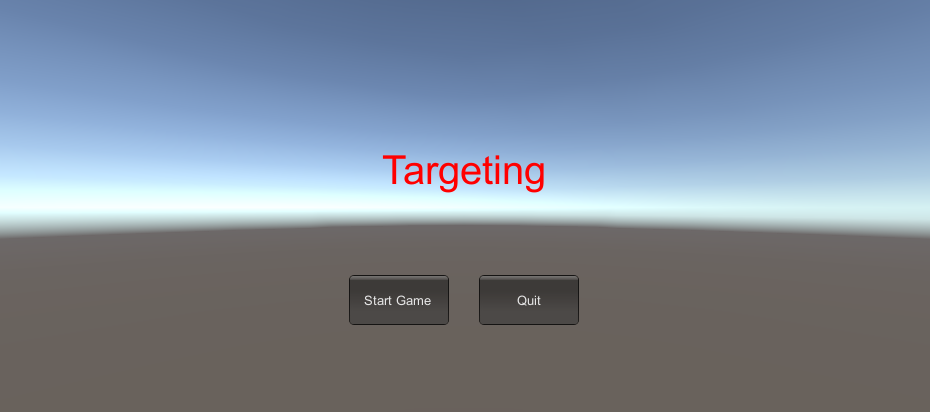
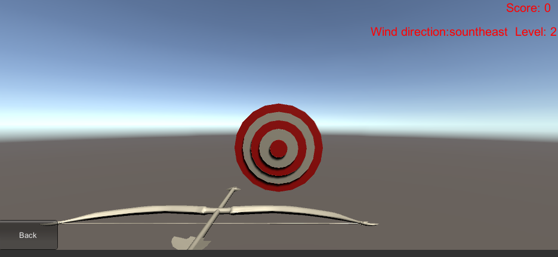
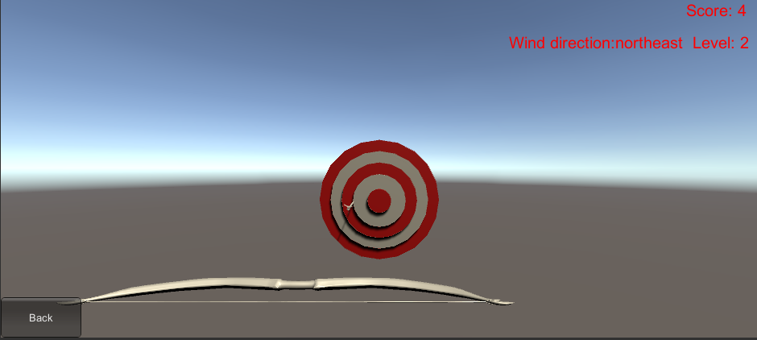
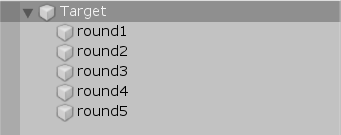
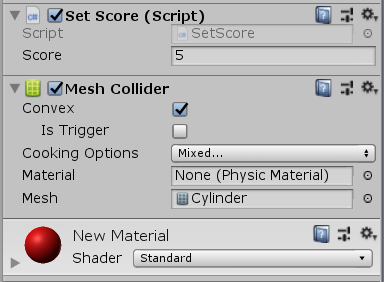
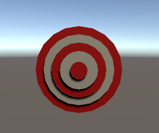

# 打靶游戏 —— Targeting

[toc]

[演示视频]( https://www.bilibili.com/video/av71789036/ )

## 游戏内容要求：

1. 靶对象为 5 环，按环计分；
2. 箭对象，射中后要插在靶上
   - **增强要求**：射中后，箭对象产生颤抖效果，到下一次射击 或 1秒以后
3. 游戏仅一轮，无限 trials；
   - **增强要求**：添加一个风向和强度标志，提高难度

## 玩法介绍

通过方向键控制弓箭左右（不可以上下）移动

每次射击之后箭留在靶上，再点击一次回到弓上

## 游戏截图







## 游戏设计

### 靶的设计

靶子由五个圆柱体组成（最小的最前面最靠近主摄影）



为每一个圆柱体round设置不同的分数，分数由Set Score脚本控制，在预设中提前设置

```c#
public class SetScore : MonoBehaviour
{
    public int score;
}
```

并且添加Mesh Collider组件





### 弓箭的设计

我的弓箭是从Asset Store找的预制

添加组件Mesh Collider


我们通过代码动态为箭加入以下脚本，用于检测中靶事件

```c#
public class checkCollision : MonoBehaviour
{
    public GameSceneController gameSceneController;
    private void Start() {
        gameSceneController = Director.getInstance().currentSceneController as GameSceneController;
    }
    void OnTriggerEnter(Collider other)
    {
        if(this.gameObject.tag == "arrow")
        {
			//表示箭头已中靶  
            this.gameObject.tag = "head";

           //加分 Judge.getInstance().addScore(other.transform.gameObject.GetComponent<SetScore>().score);
        }
    }
}
```


### Action的设计

其实这个游戏主要的部分是在Action动作的实现上

1. 弓箭的移动动作

   移动动作首先要判断弓箭是否移出了屏幕的视线范围，如果没有，则按键盘执行对应的移动

   具体的动作：MoveAction : SSAction //通过transform.Translate实现平移效果

   ```c#
   public class MoveAction : SSAction
   {
   public float TranslationX;
   public float speed;
   
   public static MoveAction GetSSAction(GameObject gameObject,float _TranslationX,float speed,ISSActionCallback _callback){
       MoveAction action = ScriptableObject.CreateInstance<MoveAction>();
   
       action.TranslationX = _TranslationX;
       action.speed = speed;
       action.gameobject = gameObject;
       action.transform = gameObject.transform;
       action.callback = _callback;
   
       return action;
   }
   
   public override void Update(){
       this.gameobject.transform.Translate(TranslationX*speed*Time.deltaTime,0,0);
       this.destroy = true;
       this.callback.SSActionEvent(this);
   }
   
   public override void Start(){}
   }
   ```

   具体的判断弓箭范围我放在了ActionManager中

   ```c#
   public void moveBow(GameObject bow,GameObject arrow,float TranslationX)
   {
       if(bow.transform.position.x > 1.4f)
       {
           bow.transform.position = new Vector3(1.4f,bow.transform.position.y,bow.transform.position.z);
           arrow.transform.position = new Vector3(1.4f,bow.transform.position.y + 0.5f,bow.transform.position.z);
           return;
       }
       if(bow.transform.position.x < -1.4f)
       {
           bow.transform.position = new Vector3(-1.4f,bow.transform.position.y,bow.transform.position.z);
           arrow.transform.position = new Vector3(-1.4f,bow.transform.position.y + 0.5f,bow.transform.position.z);
           return;
       }
       //如果符合条件，则移动弓和箭
       SSAction action = MoveAction.GetSSAction(bow,TranslationX,AnimateSpeed,this);
       SSAction action2 = MoveAction.GetSSAction(arrow,TranslationX,AnimateSpeed,this);
       addAction(action);
       addAction(action2);
   }
   ```

2. 箭的飞行动作

   飞行的动作主要通过Rigidbody的AddForce来实现

   还要考虑的是飞行动作的结束由两个可能

   - 中靶，回调函数调用箭的颤抖动作
   - 没中靶，越过靶子，回调函数重新设置箭的位置和状态

   具体的动作ArrowShootAction：SSAction

   ```c#
   public class ArrowShootAction : SSAction
   {
       public Vector3 force;                  
       public Vector3 wind;
       public Rigidbody rigidbody;
   
       public static ArrowShootAction GetSSAction(GameObject gameObject,Vector3 wind,ISSActionCallback _callback)
       {
           ArrowShootAction action = ScriptableObject.CreateInstance<ArrowShootAction>();
           action.gameobject = gameObject;
           action.force = new Vector3(0, 0, 20);
           action.wind = wind;
           action.rigidbody = gameObject.GetComponent<Rigidbody>();
           action.callback = _callback;
           return action;
       }
       public override void Start()
       {
           gameobject.GetComponent<Rigidbody>().velocity = Vector3.zero;
           gameobject.GetComponent<Rigidbody>().AddForce(force, ForceMode.Impulse);
       }
       public override void Update(){}
   
       public override void FixedUpdate()
       {
           this.rigidbody.AddForce(wind, ForceMode.Force);
           if (this.gameobject.transform.position.z > 30 )//超出范围
           {
               this.gameobject.GetComponent<Rigidbody>().isKinematic = true;
               Debug.Log("callback 0");
               this.destroy = true;
               this.callback.SSActionEvent(this,SSActionEventType.Reload);
           }
           else if(this.gameobject.tag == "head")//中靶
           {
               this.gameobject.GetComponent<Rigidbody>().isKinematic = true;
               Debug.Log("callback 1");
               this.destroy = true;
               this.callback.SSActionEvent(this,SSActionEventType.Unfinish);
           }
       }
   }
   ```

   ActionManager中处理回调的函数

   ```c#
   public void SSActionEvent(SSAction source,
           SSActionEventType events = SSActionEventType.Competeted,
           int intParam = 0,
           string strParam = null){
       runSequence.Remove(source);
       if(events == SSActionEventType.Unfinish)
       {
           SSAction action = ArrowShakeAction.GetSSAction(source.gameobject,this);
           addAction(action);
       }
       else if(events == SSActionEventType.Reload)
       {
           this.callback.SSActionEvent(source);
       }
   }
   ```

3. 箭中靶的颤抖动作

   通过上下移动实现颤抖的视觉效果，这里的上下移动通过设置逐渐增大的角度和余弦函数修改对应的y值来获得

   具体动作 ArrowShakeAction ：SSAction

   ```c#
   public class ArrowShakeAction : SSAction
   {
       public Vector3 startPos;
       public int times = 3;
       public float radian = 0;
       public float radius = 0.1f;
       public float deltaRadian = 5f;
       public float actionTime = 1.0f;
       
       public static ArrowShakeAction GetSSAction(GameObject gameObject,ISSActionCallback _callback)
       {
           ArrowShakeAction action = ScriptableObject.CreateInstance<ArrowShakeAction>();
           action.gameobject = gameObject;
           action.startPos = gameObject.transform.position;
           action.callback = _callback;
           return action;
       }
       public override void Start(){}
       public override void FixedUpdate()
       {
           if(actionTime <= 0)
           {
               this.destroy = true;
               Debug.Log("callback 2");
               this.callback.SSActionEvent(this,SSActionEventType.Reload);
           }
           actionTime -= Time.deltaTime;
   		//增大角度，颤抖效果加剧
           radian = radian + deltaRadian;
           this.gameobject.transform.position = startPos + new Vector3(0,Mathf.Cos(radian)*radius,0);
       }
       public override void Update()
       {}
   }
   ```

   