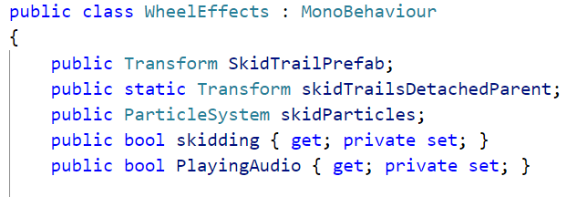
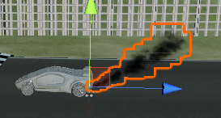

# 粒子系统

[toc]

[Github项目地址]()

由于实现效果比较简单，就不录制视频了

在开始我们的实验之前，我们先简单了解一下粒子系统每一个属性的含义和效果。


- Duration：系统运行的时间长度（如果勾选Looping则表示粒子发射周期）。
- Looping：如果启用，系统将在其持续时间结束时再次启动，并继续重复该循环。
- Prewarm：如果启用，则将系统初始化为已完成一个完整的周期（仅在还启用了循环的情况下才起作用）。
- Start Delay：一旦启用，系统开始发射之前的延迟（秒）
- Start Lifetime：粒子的初始寿命
- Start Speed：每个粒子在适当方向上的初始速度
- 3D Start Size：如果你想单独控制每个轴的大小，则启用
- Start Size：每个粒子的初始大小
- 3D Start Rotation：如果要单独控制每个轴的旋转，则启用
- Start Rotation：每个粒子的初始旋转角度
- Randomize Rotation Direction：使某些粒子沿相反方向旋转
- Start Color：每个粒子的初始颜色
- Gravity Modifier：缩放在 physics manager 中设置的重力值。 零值将关闭重力。
- Simulation Space：控制粒子是在父对象的本地空间（随父对象移动），在世界空间中还是相对于自定义对象（随您选择的自定义对象移动）处于动画状态。
- Simulation Speed：调整整个系统的更新速度。
- Delta Time：在“ **Scaled**  ”和“ **Unscaled** ”之间选择，“**Scaled**  ”使用时间管理器中的**Time Scale** ，“**Unscaled**”将忽略它。这对于出现在“暂停”菜单上的“粒子系统”很有用。
- Scaling Mode：选择如何使用Transform中的Scale。 设置为 **Hierarchy** ， **Local**  或 **Shape** 。 **Local**  仅应用“粒子系统”变换比例，忽略任何父级。  **Shape** 将比例应用于粒子的起始位置，但不影响其大小。
- Play on Awake：如果启用该选项，则在创建对象时“粒子系统”将自动启动。
- Emitter Velocity：选择“粒子系统”如何计算“继承速度”和“发射”模块所使用的速度。 系统可以使用刚体组件（如果存在）或通过跟踪 Transform 组件的运动来计算速度。
- Max Particles：一次系统中的最大粒子数。 如果达到极限，则将除去一些颗粒。
- Auto Random Seed：如果启用，粒子系统每次播放时都会看起来不同。 设置为false时，每次播放时系统都是完全相同的。
- Random Seed：禁用自动随机种子时，此值用于创建独特的可重复效果。
- Stop Action：当所有属于系统的粒子都完成后，就可以使系统执行一个动作。 当一个系统的所有粒子都死亡并且其寿命已经超过其持续时间时，就确定该系统已停止。 对于循环系统，仅当通过脚本停止系统时才会发生这种情况。
-  Culling Mode：配置“粒子系统”在屏幕外时是否仍将在每帧进行模拟。
-  Ring Buffer Mode：控制如何从“粒子系统”中删除粒子。

剩余的其他模块可自行到官方文档查看

[Emission module]( https://docs.unity3d.com/2018.1/Documentation/Manual/PartSysEmissionModule.html ) / [Shape Module]( https://docs.unity3d.com/2018.1/Documentation/Manual/PartSysShapeModule.html ) / [Velocity over Lifetime module]( https://docs.unity3d.com/2018.1/Documentation/Manual/PartSysVelOverLifeModule.html ) / [Limit Velocity Over Lifetime module]( https://docs.unity3d.com/2018.1/Documentation/Manual/PartSysLimitVelOverLifeModule.html ) / [Inherit Velocity module]( https://docs.unity3d.com/2018.1/Documentation/Manual/PartSysInheritVelocity.html ) / [Force Over Lifetime module]( https://docs.unity3d.com/2018.1/Documentation/Manual/PartSysForceOverLifeModule.html ) / [Color Over Lifetime module]( https://docs.unity3d.com/2018.1/Documentation/Manual/PartSysColorOverLifeModule.html ) / [Renderer module]( https://docs.unity3d.com/2018.1/Documentation/Manual/PartSysRendererModule.html ) 

……

## 简单粒子制作

- 按参考资源要求，制作一个粒子系统，[参考资源](http://www.cnblogs.com/CaomaoUnity3d/p/5983730.html)

  结果截图

  <table>
      <tr>
          
          
      </tr>
  </table>

  制作过程：

  根据**参考资源**，我们将其分为两部分，一部分为光晕，一部分为星光

  - 光晕

    首先选择粒子材料并设置渲染

    这里使用**参考资源**所提供的Material资源，可以看到该Material中有4个纹理贴图

    

    于是我们在设置Renderer Module的Material之外，还要添加Texture Sheet Animation Module，并设置Tiles为 2 * 2 ， 表示纹理在X（水平）和Y（垂直）方向上划分的平铺数量，还要设置Frame over Time恒为2

    

    设置运动与发射器

    - 设置运动状态色彩变化

      设置Color over Lifetime

      

    - 设置Shape

      由于我们的光晕是不动的，所以设置Shape为半径为0的Sphere或者长宽高为0的Box

      

    - 设置Emission和Main Module

      这里我们主要设置粒子的大小，刷新时间(这里由于我自己设的显示效果总是不好，所以参考了**参考资源**的数值)，旋转角度（光晕是旋转的，所以设置为在0-90内随机旋转）

      

  - 星光

    选择粒子材料并设置渲染

    这里和光晕一样，就是Frame over Time设置为恒为1（星星图案）

    选择运动与发射器

    - 设置Color over Lifetime

      

    - 设置Size over Lifetime

      

    - 设置Emission和Main Module

      这里设置一下速度和刷新时间即可

      

-  用代码控制使之在不同场景下效果不一样 

  根据课堂例子的改编，可以简单实现一个根据亮度不同产生不同数量的星光的效果

  ```c#
  using UnityEngine;
  using System.Collections;
  
  public class PartScriptTestCS : MonoBehaviour {
  
      public float lightness;
      public float defaultRate;
  
      ParticleSystem Stars;
  
      void Start () {
          Stars = GetComponent<ParticleSystem>();
      }
  
      void Update () {
          Stars.emissionRate = defaultRate * lightness;
      }
  }
  ```

## 完善官方的“汽车尾气”模拟

> 由于本次实验重点在于粒子系统，这里我就直接在Scene中放入预制，而不是代码生成了

1. 首先我们先导入官方资源包（Unity2018.2之后的版本不再自带对应版本的Standard Asset），但我们可以到Asset Store中下载

   

2. 然后导入，但是我们不需要导入所有，选择如下

   

3. 然后在Asset Store里添加了一些修饰场景的预设

4. 我们可以发现，Standard Asset里面的Car是自带ParticleSystem的，不过这是实现轮胎打滑/刹车时的轮胎效果，我们可以参考一下，这里我们还要注意一下，WheelEffects脚本中寻找ParticleSystem组件用的是`transform.root.GetComponentInChildren<ParticleSystem>()`，所以要避免和这个脚本发生冲突

   <table>
       <tr>
           
           
       </tr>
   </table>

   首先先新建一个尾气的粒子系统

   设置如图
   
   
   
   
   
   接下来，我们编写汽车碰撞的脚本（挂载到Car上）
   
   ```c#
   using System.Collections;
   using System.Collections.Generic;
   using UnityEngine;
   
   namespace CarSimulate{
       public class CheckCollide : MonoBehaviour{
           public float degreeOfDamage{get;set;}
   
           private void OnCollisionEnter(Collision other) {
               //Get the speed of this car when collision happens
               float speed = this.gameObject.GetComponent<Rigidbody>().velocity.magnitude;
               //The degree of damage is proportional to the speed of the collision
               degreeOfDamage += speed;
               //Debug.Log("degreeOfDamage:"+degreeOfDamage);
           }
       }
   }
   ```
   
   然后编写根据当前车的速度以及碰撞程度修改粒子的效果
   
   速度（可从已有得CarController获取）越快，每次发射得粒子越多
   
   碰撞越多，尾气消失（Alpha = 0）得越晚
   
   ```c#
   public float engineRevs;
   public float degreeOfDamage;
   public float exhaustRate = 10f;
   
   ParticleSystem exhaust;
   
   CarController carController;
   CheckCollide checkCollide;
   
   
   
   void Start () {
       exhaust = GetComponent<ParticleSystem>();
       carController = this.transform.parent.parent.gameObject.GetComponent<CarController>();
       checkCollide = this.transform.parent.parent.gameObject.GetComponent<CheckCollide>();
   }
   
   
   void Update () {
       //The faster the speed, the more particles are emitted
       engineRevs = carController.Revs;
       //Debug.Log("Revs:"+engineRevs);
       exhaust.emissionRate = engineRevs * 100f + exhaustRate;
       Debug.Log("Rate:"+exhaust.emissionRate);
   
       degreeOfDamage = checkCollide.degreeOfDamage;
       float colorRatio = (degreeOfDamage % 400.0f) / 400.0f % 0.8f + 0.2f; //Avoid colorRatio greater than one and less than 0.2
       var col = exhaust.colorOverLifetime;
       col.enabled = true;
   
       //The more collisions, the longer the exhaust exists
       Gradient grad = new Gradient();
       grad.SetKeys( new GradientColorKey[] {new GradientColorKey(Color.white, 0.0f), new GradientColorKey(Color.white, colorRatio), new GradientColorKey(Color.white, 1.0f) }, new GradientAlphaKey[] {new GradientAlphaKey(1f, 0.0f),new GradientAlphaKey(0.5f, colorRatio), new GradientAlphaKey(0f, 1.0f) } );
   
       col.color = grad;
   }
   ```
   
   
   
   结果截图：
   
   当汽车少量碰撞之后静止
   
   
   
   当汽车少量碰撞运行
   
   
   
   当汽车大量碰撞静止
   
   
   
   当汽车大量碰撞运行
   
   

##  使用粒子流编程控制制作一些效果， 如“粒子光环” 

根据[外文翻译Unity制作神奇的粒子海洋]( http://www.manew.com/thread-47123-1-1.html )制作粒子光环效果

要实现的内容：

- 创建粒子系统和数组
- 分配粒子位置
- 使所有元素能很好地流畅的循环运动
- 颜色

1.  一个粒子系统、一个粒子数组、粒子的数量和实现颜色变化的Gradient

   游戏开始时创建一个存放所有粒子的数组。设置最大粒子数量。在后边两个步骤中生成所有的粒子并将它们放入数组。 

   ```c#
   public class ParticleHalo : MonoBehaviour{
   	public int particleCount = 1000;
       
       private ParticleSystem particleSystem;
       private ParticleSystem.Particle[] particleArray;
       private ParticlePos[] particlePos;
       
       private void Start() {
           particleSystem = GetComponent<ParticleSystem>();
   		//创建一个存放所有粒子的数组
           particleArray = new ParticleSystem.Particle[particleCount];
           particlePos = new ParticlePos[particleCount];
   		//设置最大粒子数量
           var main = particleSystem.main;
           main.maxParticles = particleCount;
   		//生成所有的粒子并将它们放入数组
           particleSystem.Emit(particleCount);
           particleSystem.GetParticles(particleArray);
   
           setParticlePos();
       }
   }
   ```

2. 分配粒子位置

    现在已经有了创建粒子的系统，并且已经在particlesArray配置好了 ，接下来要做的是遍历每一个粒子并为其分配一个唯一的位置。

   这里我们另外定义一个结构体用来存储粒子的位置信息，这是便于后面的旋转操作

   ```c#
   public class ParticlePos{
       public float angle{get;set;}
       public float radius{get;set;}
   
       public ParticlePos(float _radius,float _angle){
           this.angle = _angle;
           this.radius = _radius;
       }
   }
   ```

   

   ```c#
   public float minRadius = 4.0f;
   public float maxRadius = 7.0f;
   
   private void setParticlePos(){
   
       for(int i = 0;i<particleCount;i++){
           float radius = Random.Range(minRadius,maxRadius);
           float angle = Random.Range(0f,360f);
   
           particlePos[i] = new ParticlePos(radius,angle);
   
           particleArray[i].position = new Vector3(radius*Mathf.Cos(angle),0f,radius*Mathf.Sin(angle));
       }
   
       particleSystem.SetParticles(particleArray,particleArray.Length);
   }
   ```

   接下来我们还需要配置一下ParticleSystem，这一步就在Inspector中完成了……

   

3. 旋转操作

   在Update函数中为角度angle添加一个随机的增量

   ```c#
   private void Update() {
   
       for(int i = 0;i<particleCount;i++){
           particlePos[i].angle = (particlePos[i].angle + Random.Range(0.001f,0.006f) % 360f);
   
           particleArray[i].position = new Vector3(particlePos[i].radius*Mathf.Cos(particlePos[i].angle),0f,particlePos[i].radius*Mathf.Sin(particlePos[i].angle));
       }
   
       particleSystem.SetParticles(particleArray,particleArray.Length);
   }
   ```

4. 颜色

   使用 Gradient 变量，然后根据半径使粒子呈现不同颜色

   在Update中添加

   ```c#
   public Gradient colorGradient;
   
   private void Update() {
       ...
       particleArray[i].startColor = colorGradient.Evaluate((particlePos[i].radius - minRadius)/(maxRadius-minRadius));
       ...
   }
   ```

结果截图

