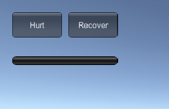
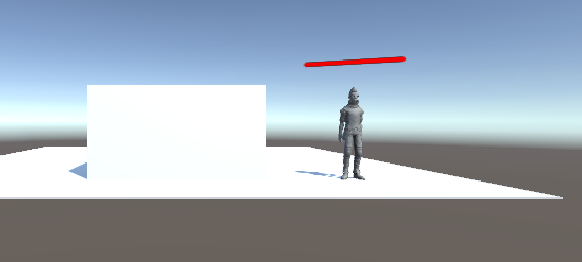
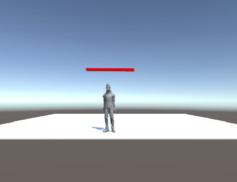
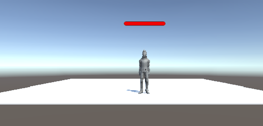
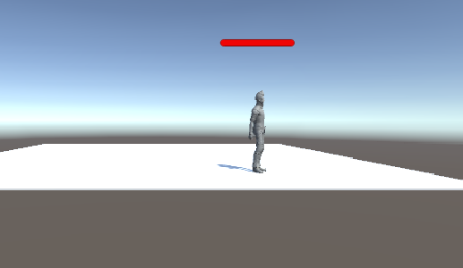
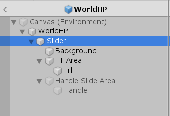
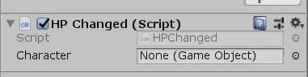
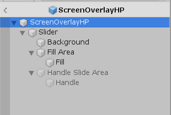
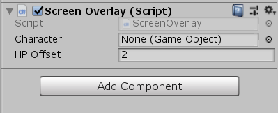

# UI系统

[toc]

[Github项目地址]( https://github.com/wywwwwei/3DGameProgramming/tree/master/HW9)

[视频演示地址]( https://www.bilibili.com/video/av76140329/ )

## 小结

> UI 即 User Interface（用户界面）的简称。在许多软件中，采用狭义的概念，特指窗体、面板、按钮、文本框等人们熟悉的人机交互元素，及其组织与风格（也称皮肤）。 
>
> Unity 目前支持三套完全不同风格的 UI 系统：
>
> -  4.0 及以前 - IMGUI（Immediate Mode GUI）及时模式图形界面
>
>   IMGUI 主要用于以下[场景](https://docs.unity3d.com/Manual/GUIScriptingGuide.html)：
>
>   - 在游戏中创建调试显示工具
>   - 为脚本组件创建自定义的 Inspector 面板。
>   - 创建新的编辑器窗口和工具来扩展 Unity 环境。
>
> 
>
> -  5.0 及以后 - Unity GUI / UGUI 是面向对象的 UI 系统 
>
>   UGUI 的优势：
>
>   - 所见即所得（WYSIWYG）设计工具
>   - 支持多模式、多摄像机渲染
>   - 面向对象的编程
>
> 
>
> -  2018.3 及以后 - UXML（unity 扩展标记语言）

UGUI 基础 —— 渲染模式

画布组件有渲染模式（Render Mode）设置，可用于使其在屏幕空间（Screen Space）或世界空间（World Space）中渲染。

**屏幕空间 - 叠加（Screen Space - Overlay）**

将UI元素放置在场景顶部渲染的屏幕，画布会自动更改大小匹配屏幕。Canvas 默认中心点为屏幕中心！

**屏幕空间 - 相机（Screen Space - Camera）**

画布放在制定的渲染摄像机前，如 100 的位置，画布会自动匹配为屏幕分辨率。Canvas 默认中心点为屏幕中心！ 

**世界空间（World Space）**

画布行为与场景中的其他任何对象一样，UI元素将放置在其他对象的前面或后面渲染。**画布大小和位置任意设置**，这对于意在成为世界一部分的用户界面非常有用。


##  血条（Health Bar）的预制设计

具体要求如下

- 分别使用 IMGUI 和 UGUI 实现
- 使用 UGUI，血条是游戏对象的一个子元素，任何时候需要面对主摄像机
- 分析两种实现的优缺点
- 给出预制的使用方法

首先我们为人物都挂在上一个Health的组件，上面记录着当前的血量和总血量，以及受到伤害和恢复的函数调用

```c#
public class Health : MonoBehaviour
{
    public float curHP;
    public float nextHP;
    public float fullHP = 100.0f;

    private void Start() {
        curHP = fullHP;
        nextHP = fullHP;
    }

    private void Update() {
        //Linear interpolation to make HP change smoothly
        curHP = Mathf.Lerp(curHP, nextHP, 0.05f);
    }

    public void Hurt(){
        nextHP = (curHP - 10.0f)>=0f?curHP-10.0f:0.0f;
    }

    public void Recover(){
        nextHP = fullHP;
    }
}
```

### IMGUI实现

IMGUI其实是我之前用的比较多的一种实现UI的方法（ 通过OnGUI函数来开发UI界面 ），不过仅限于设置Button/Label，这次我们需要实现血条的话，我们需要什么部件呢？

[GUI.HorizontalScrollbar]( https://docs.unity3d.com/ScriptReference/GUI.HorizontalScrollbar.html )

只需将以下代码挂载到人物身上即可

这里就直接将血条固定了，如果不想固定，就可以参考后面的Screen Space，将世界坐标转换为屏幕坐标

```c#
[RequireComponent(typeof(Health))]
public class IMGUI : MonoBehaviour
{
    private GameObject Character;
    private float curHP;
    private float fullHP;
    private void Start() {
        Character = this.gameObject;
    }

    private void OnGUI() {
        if(GUI.Button(new Rect(20,20,80,40),"Hurt"))
        {
            Character.GetComponent<Health>().Hurt();
        }
        if(GUI.Button(new Rect(110,20,80,40),"Recover"))
        {
            Character.GetComponent<Health>().Recover();
        }

        curHP = Character.GetComponent<Health>().curHP;
        fullHP = Character.GetComponent<Health>().fullHP;

        GUI.HorizontalScrollbar(new Rect(20,90,170,20), 0.0f, curHP, 0.0f, fullHP);
    }
}
```



### UGUI实现

#### World Space

> 课件中已经描述了该方法的具体实现，在其基础上做一些修改即可

- 菜单 Assets -> Import Package -> Characters 导入资源
- 在层次视图，Context 菜单 -> 3D Object -> Plane 添加 Plane 对象
- 资源视图展开 Standard Assets :: Charactors :: ThirdPersonCharater :: Prefab
- 将 ThirdPersonController 预制拖放放入场景，改名为 Ethan
- 检查以下属性
  - Plane 的 Transform 的 Position = (0,0,0)
  - Ethan 的 Transform 的 Position = (0,0,0)
  - Main Camera 的 Transform 的 Position = (0,1,-10)
- 运行检查效果
- 选择 Ethan 用上下文菜单 -> UI -> Canvas, 添加画布子对象
- 选择 Ethan 的 Canvas，用上下文菜单 -> UI -> Slider 添加滑条作为血条子对象
- 运行检查效果
- 选择 Ethan 的 Canvas，在 Inspector 视图
  - 设置 Canvas 组件 Render Mode 为 World Space
  - 设置 Rect Transform 组件 (PosX，PosY，Width， Height) 为 (0,2,160,20)
  - 设置 Rect Transform 组件 Scale （x,y） 为 (0.01,0.01)
- 运行检查效果，应该是头顶 Slider 的 Ethan，用键盘移动 Ethan，观察
- 展开 Slider
  - 选择 Handle Slider Area，禁灰（disable）该元素
  - 选择 Background，禁灰（disable）该元素
  - 选择 Fill Area 的 Fill，修改 Image 组件的 Color 为 红色
- 选择 Slider 的 Slider 组件
  - 设置 MaxValue 为 100
  - 设置 Value 为 75
- 运行检查效果，发现血条随人物旋转

为了使血条一直朝向摄像机，我们添加以下脚本到Canvas中

```c#
using UnityEngine;

namespace LookAtCamera{
    public class LookAtCamera : MonoBehaviour 
    {
        void Update () 
        {
            this.transform.LookAt (Camera.main.transform.position);
        }
    }
}
```

为了（个人认为）美观，我们将

- Background勾选上，将Rect Transform的Left/Top/Right/Bottom都设置为0
- 同时将fillArea/fill的Rect Transform的Left/Top/Right/Bottom都设置为0

血量的属性应该属于EThan对象，所以我们的图像绘制应该都是从该对象上获取，于是我们为该slider添加脚本

```c#
using System.Collections;
using System.Collections.Generic;
using UnityEngine;
using UnityEngine.UI;

namespace HealthBar{
    public class HPChanged : MonoBehaviour
    {
        public GameObject character;
        private void Start() {
            //将当前血条设置为满
            this.gameObject.GetComponent<Slider>().maxValue = character.GetComponent<Health>().fullHP;
        }
        private void Update() {
            //获取并设置当前血量
            this.gameObject.GetComponent<Slider>().value = character.GetComponent<Health>().curHP;
        }
    }
}
```





####  Screen Space - Overlay

课件中提到

> 如果你在生产中使用上述血条，足以证明你是入门级别程序员。为了显示血条，每个图片从 pixel 单位映射到 world space，再投影到摄像机空间，在变成屏幕空间（pixel 单位）。这需要多少算力？
>
> 因此，能用 Srceen Space 解决的问题绝不用 World Space， 能用 Overlay 解决问题绝不用 Camera！
>
> 而血条恰恰是 Srceen Space - Overlay 能决解的
>
> > 考虑screen space camera 类型的呈现进行大量的调用，所以非常推荐使用Overlay 绘制画布，使你的游戏在移动设备上更顺畅。（当然了这种只是限于纯UI），但是另外两种模式是有其特殊用处的！

参考 [Faking World Space for monster health bars in Unity](http://blog.manapebbles.com/world-space-overlay-camera-in-unity/) 

Canvas和Slider的设置与上面基本一致，就是Canvas的Render Mode要修改为Screen Space - Overlay

> 只有在World Space渲染模式下才可以修改Canvas的Transform

实现思路：

1. 首先获取头顶的世界坐标
2. 通过相机将头顶的坐标转换为屏幕的坐标，这就是血条的位置
3. 最后调整血条value即可

实现代码（挂载到Canvas上）：

```c#
using System.Collections;
using System.Collections.Generic;
using UnityEngine;
using UnityEngine.UI;

namespace HealthBar{
    public class ScreenOverlay : MonoBehaviour
    {
        public GameObject Character;
        public float HPOffset = 2.5f;//头顶位置相较人物的偏移量
        private Slider healthSlider;
        // Start is called before the first frame update
        void Start()
        {
            //获取slider组件
            healthSlider = this.gameObject.GetComponentInChildren<Slider>();
            healthSlider.maxValue = Character.GetComponent<Health>().fullHP;
        }

        // Update is called once per frame
        void Update()
        {
            healthSlider.value = Character.GetComponent<Health>().curHP;
			//调整血条位置（世界坐标->屏幕坐标）
            Vector3 worldPos = new Vector3(Character.transform.position.x, Character.transform.position.y + HPOffset, Character.transform.position.z);
            Vector3 screenPos = Camera.main.WorldToScreenPoint(worldPos);
            healthSlider.transform.position = new Vector3(screenPos.x, screenPos.y, screenPos.z);
        }
    }
}

```

实现效果





#### 关于人物被遮挡时，血条的显示问题

其实一开始我是想用射线检测的方法来控制Canvas的显示与否，但实际的效果却不太好，因为人物不是一个点，很难去判断到底有没有被完全遮挡，其次，射线检测要求之间遮挡的物体（例如一个简单的Cube）一定是碰撞体……下面先放大概的代码，我就不放在demo中了，因为效果不好

```c++
public GameObject player;
private Vector3 distance;
bool ifShow = true;

public void Update()
{
    distance = transform.position - player.transform.position;
    if (Physics.Raycast(transform.position, player.transform.position - transform.position,out  hitInfo)){
               if (hitInfo.collider.tag != TAGS.Player)
               {
                   if(ifShow)
                   {
                       ifShow = false;
                       player.GetComponent<Canvas>().SetActive(false);
                   }
               }
               else
               {
                   if(!ifShow)
                   {
                       ifShow = true;
                       player.GetComponent<Canvas>().SetActive(true);
                   }
               }
           }
}
```

## 分析两种实现的优缺点

IMGUI：

-  如果不做复杂的界面，代码简单易用 
-  在修改模型，渲染模型这样的经典游戏循环编程模式中，在渲染阶段之后，绘制 UI 界面无可挑剔 
-  避免了 UI 元素保持在屏幕最前端，又有最佳的执行效率，一切控制掌握在程序员手中，这对早期计算和存储资源贫乏的游戏设备来说，更是弥足珍贵。 

缺点：

-  传统代码驱动的 UI 开发效率低下，难以调试

IMGUI是其中GUI系统通常不保留有关GUI的信息，而是反复要求您重新指定控件是什么，控件在哪里等的控件。当您以函数调用的形式指定UI的每个部分时，会立即对其进行处理（绘制，单击等），并且任何用户交互的后果都会立即返回给您，而无需您进行查询。这对于游戏UI而言效率低下，由于一切都变得非常依赖于代码，因此对于设计师来说不方便使用。

但是它对于非实时情况，由代码驱动，希望根据当前状态轻松更改显示的控件的处理是非常方便的，也就是说，它是一个很好的编辑面板的选择。

UGUI：

优点：

- 为了让设计师也能参与参与程序开发，从简单的地图编辑器、菜单编辑器等工具应运而生。 设计师甚至不需要程序员帮助，使用这些工具就可直接创造游戏元素，乃至产生游戏程序。 
- 所见即所得（WYSIWYG）设计工具
- 支持多模式、多摄像机渲染
- 面向对象的编程

##  预制的使用方法 

IMGUI预制的使用方法

其实IMGUI的实现就是一个脚本，所以**直接将该脚本挂载到人物对象身上**即可

UGUI预制的使用方法

将预制实例化后，添加到人物对象的子对象中

- World Space

  并将人物对象拖动到Slider中挂载的脚本HP Changed的Character中

  

  

- Screen Space

  并将人物对象拖动到ScreenOverlayHP中挂载的脚本Screen Overlay的Character中

  

  